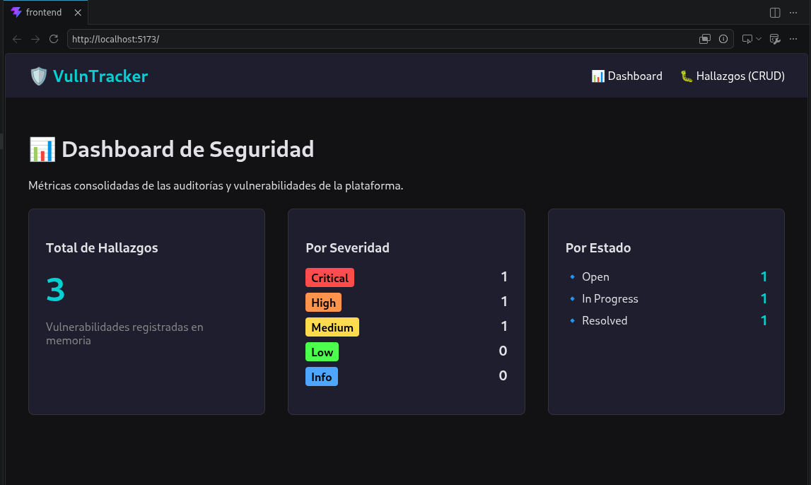
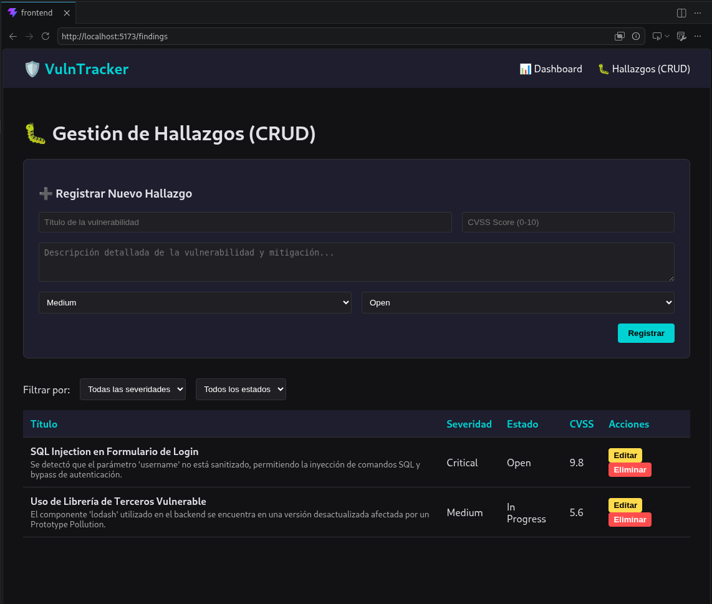

# VulnTracker - Plataforma de Seguimiento de Vulnerabilidades
 
Este proyecto es el Trabajo Práctico Integrador para la materia **Arquitectura Web** de la **Universidad de Palermo**.
 
**Profesor:** Diego MARAFETTI , Adrian Ezequiel MARTINEZ

**Estudiante:** Mariano MEDICI

**Legajo:** 112570
 
---
 
## 📋 Descripción
 
VulnTracker es una plataforma web para registrar y hacer seguimiento de vulnerabilidades detectadas en auditorías de seguridad. El dominio de pentesting es el contexto de negocio elegido; la aplicación **no realiza escaneos automáticos ni acciones ofensivas**.
 
### Alcance
 
- CRUD completo de hallazgos (*Finding*): crear, leer, actualizar y eliminar.
- Clasificación por severidad: `Critical`, `High`, `Medium`, `Low`, `Info`.
- Estado del hallazgo: `Open`, `In Progress`, `Resolved`.
- CVSS Score como campo opcional (0.0–10.0).
- Dashboard con estadísticas agregadas por severidad y estado.
- Filtrado por severidad y estado vía query params.
### Fuera del alcance (primera etapa)
 
- Gestión de proyectos (previsto para etapas posteriores).
- Autenticación de usuarios.
- Persistencia en base de datos (se usa in-memory store con seed data).
---
 
## 🏗️ Arquitectura
 
La aplicación sigue una arquitectura cliente-servidor. El frontend se comunica con el backend exclusivamente a través de la API REST en formato JSON.
 
| Capa         | Tecnología               | Rol                                  |
|--------------|--------------------------|--------------------------------------|
| Frontend     | React + Vite + React Router | Presentación. Sin lógica de negocio. |
| Backend      | Node.js + Express        | API REST y lógica de negocio.        |
| Persistencia | In-memory (JS arrays)    | Store con seed data al iniciar.      |
| Testing      | Jest + Supertest         | Tests sobre los endpoints HTTP.      |
 
### Decisiones técnicas
 
- **React + Vite**: desarrollo rápido, componentes reutilizables, sin dependencias pesadas.
- **Express**: framework minimalista que permite diseño limpio de rutas y middlewares.
- **In-memory store**: elimina la necesidad de instalar una base de datos; suficiente para demostrar todos los conceptos del TP.
- **Jest + Supertest**: tests de integración reales sobre HTTP sin levantar un servidor externo.
### Estructura del proyecto
 
```
vulntracker/
├── backend/
│   ├── src/
│   │   ├── routes/       # Rutas Express: /findings, /stats
│   │   ├── controllers/  # Handler de cada endpoint
│   │   ├── services/     # Lógica de negocio
│   │   └── store/        # In-memory store + seed data
│   ├── tests/            # Tests con Jest + Supertest
│   ├── jest.config.js
│   └── package.json
├── frontend/
│   ├── src/
│   │   ├── pages/        # Páginas: Findings (CRUD) y Dashboard
│   │   ├── components/   # Componentes reutilizables
│   │   └── api/          # Funciones fetch hacia la API
│   └── package.json
└── package.json          # Scripts raíz del monorepo
```
 
---
 
## 🗂️ Entidad principal: Finding
 
| Campo       | Tipo           | Descripción                          |
|-------------|----------------|--------------------------------------|
| id          | string (uuid)  | Identificador único auto-generado.   |
| title       | string         | Nombre del hallazgo.                 |
| description | string         | Descripción detallada.               |
| severity    | enum           | `Critical / High / Medium / Low / Info` |
| status      | enum           | `Open / In Progress / Resolved`      |
| cvss        | number (opt.)  | Puntuación CVSS 0.0–10.0.            |
| createdAt   | ISO 8601       | Fecha de creación.                   |
 
---
 
## 🔌 Endpoints
 
La API cumple con **nivel 2 del Richardson Maturity Model**: recursos identificados por URIs, verbos HTTP semánticos y códigos de estado correctos.
 
| Verbo    | Endpoint              | Descripción                                                                 |
|----------|-----------------------|-----------------------------------------------------------------------------|
| `GET`    | `/api/findings`       | Lista todos los hallazgos. Query params opcionales: `?severity=` `&status=` |
| `POST`   | `/api/findings`       | Crea un hallazgo. Body: `{ title, description, severity, status, cvss }`.   |
| `GET`    | `/api/findings/:id`   | Devuelve un hallazgo por ID.                                                |
| `PUT`    | `/api/findings/:id`   | Actualiza un hallazgo existente.                                            |
| `DELETE` | `/api/findings/:id`   | Elimina un hallazgo.                                                        |
| `GET`    | `/api/stats`          | Resumen agregado por severidad y estado (usado en el dashboard).            |
 
### Códigos de respuesta
 
| Código            | Cuándo se usa                               |
|-------------------|---------------------------------------------|
| `200 OK`          | GET y PUT exitosos.                         |
| `201 Created`     | POST exitoso.                               |
| `204 No Content`  | DELETE exitoso.                             |
| `400 Bad Request` | Campos faltantes o inválidos en el body.    |
| `404 Not Found`   | ID inexistente en GET, PUT o DELETE.        |
 
---
 
## 🧪 Testing
 
Se testean los endpoints HTTP con **Jest + Supertest**. El servidor Express se levanta en memoria para cada suite; no se requiere un proceso externo corriendo.
 
| Endpoint                | Casos cubiertos                                                          |
|-------------------------|--------------------------------------------------------------------------|
| `GET /api/findings`     | 200 con datos de ejemplo. Filtro por `?severity`. Filtro por `?status`.  |
| `POST /api/findings`    | 201 con datos válidos. 400 si falta `title`. 400 si `severity` es inválido. |
| `GET /api/findings/:id` | 200 con el hallazgo correcto. 404 si ID no existe.                       |
| `PUT /api/findings/:id` | 200 al actualizar. 404 si ID no existe.                                  |
| `DELETE /api/findings/:id` | 204 al eliminar. 404 si ID no existe.                                 |
| `GET /api/stats`        | 200 con conteos por severidad y estado.                                  |
 
---
 
## 🛠️ Requisitos Previos
 
- **Node.js**: v18 o superior
- **npm**: v9 o superior
---
 
## ⚡ Guía de Inicio Rápido
 
Abra su terminal en la **raíz del proyecto** (`vulntracker/`) y ejecute los siguientes comandos en orden:
 
```bash
# 1. Instalar todas las dependencias del Monorrepo (Raíz, Backend y Frontend)
npm run install:all
 
# 2. Correr la suite de pruebas automatizadas y ver el reporte de cobertura
npm run test:coverage
 
# 3. Levantar el Backend (:3001) y Frontend (:5173) en paralelo con Hot-Reload
npm run dev
```
 
Una vez levantado, acceder a:
- **Frontend**: http://localhost:5173
- **API Backend**: http://localhost:3001/api
---
 
## 📜 Scripts disponibles
 
| Comando                    | Descripción                                              |
|----------------------------|----------------------------------------------------------|
| `npm run install:all`      | Instala dependencias de backend y frontend.              |
| `npm run dev`              | Levanta backend (:3001) y frontend (:5173) en paralelo.  |
| `npm run dev:backend`      | Solo el servidor Express con hot-reload (nodemon).       |
| `npm run dev:frontend`     | Solo la app React con Vite.                              |
| `npm run test`             | Ejecuta los tests del backend.                           |
| `npm run test:coverage`    | Tests con reporte de cobertura.                          |
| `npm run build:frontend`   | Build de producción en `frontend/dist/`.                 |

---
 
## 🖼️ Imágenes
 
### Dashboard de Seguridad
 

 
> Métricas consolidadas: total de hallazgos, distribución por severidad (Critical, High, Medium, Low, Info) y por estado (Open, In Progress, Resolved).
 
### Gestión de Hallazgos (CRUD)
 

 
> Pantalla principal con formulario de registro, filtros por severidad y estado, y tabla con acciones de edición y eliminación.
 